# LAB 14 — Bypass Root Detection Android avec Frida, Objection et Hooks natifs

## 1. Présentation du lab

Ce laboratoire a pour objectif d’étudier le contournement dynamique de la détection root dans une application Android de test.
L’application utilisée est **RootBeer Sample**, dont le package est :

```text
com.scottyab.rootbeer.sample
```

L’idée principale du lab est de montrer qu’une application peut détecter un environnement rooté à travers plusieurs indicateurs, puis de neutraliser ces vérifications sans modifier l’APK.
Le contournement est réalisé à l’exécution avec trois approches :

* injection Frida simple pour vérifier que l’attachement fonctionne ;
* hooks Java pour masquer les contrôles classiques de root ;
* hooks natifs pour intercepter certains appels bas niveau ;
* Objection pour automatiser une partie du bypass.

Ce travail a été réalisé uniquement dans un cadre pédagogique et sur une application de laboratoire autorisée.

---

## 2. Organisation du projet

L’organisation finale de mon dossier est la suivante :

```text
LAB14---RootBypass/
│
├── images/
│   ├── 00.png
│   ├── 01.png
│   ├── 02.png
│   ├── 03.png
│   ├── 04.png
│   ├── 05.png
│   ├── 06.png
│   ├── 07.png
│   ├── 08.png
│   ├── 09.png
│   ├── 10.png
│   ├── 11.png
│   ├── 12.png
│   ├── 13.png
│   ├── 14.png
│   ├── 15.png
│   ├── root_detected_before.png
│   └── root_bypass_after.png
│
├── scripts/
│   ├── hello.js
│   ├── bypass_root_java.js
│   └── bypass_root_native_frida17.js
│
└── README.md
```

Le fichier `frida-server` n’est pas inclus dans le dossier final, car il dépend de la version de Frida utilisée et de l’architecture de l’appareil Android. Il doit être téléchargé séparément depuis les releases Frida, puis copié dans `/data/local/tmp/` sur l’émulateur ou le téléphone.

---

## 3. Environnement utilisé

Le lab a été réalisé sur Windows avec PowerShell.

Outils utilisés :

| Outil           | Utilisation                                |
| --------------- | ------------------------------------------ |
| Python          | Installation des outils Frida et Objection |
| pip             | Gestion des packages Python                |
| ADB             | Communication avec l’émulateur Android     |
| Frida           | Injection dynamique de scripts             |
| frida-server    | Agent Frida côté Android                   |
| Objection       | Automatisation de hooks Frida              |
| RootBeer Sample | Application cible du test                  |

Les premières captures montrent la vérification de l’environnement.

### Version de Frida côté PC

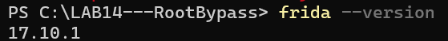

### Version du module Python Frida

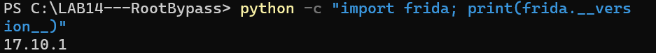

### Version de Python et pip

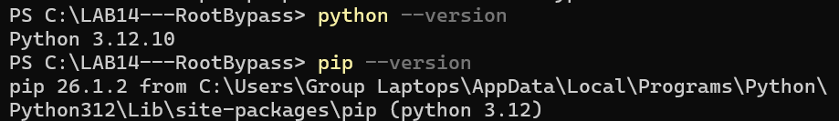

### Vérification d’Objection

La commande `objection --version` n’était pas disponible dans mon environnement.
J’ai donc utilisé :

```powershell
python -m pip show objection
```

Cette commande a confirmé qu’Objection était installé en version `1.12.5`.

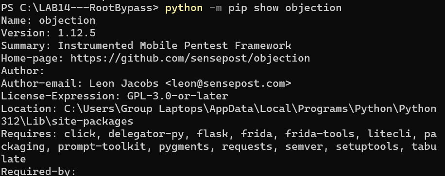

---

## 4. Vérification ADB et connexion avec l’émulateur

J’ai ensuite vérifié que ADB fonctionnait correctement et que l’émulateur Android était bien détecté.

Commandes utilisées :

```powershell
$ADB version
$ADB devices
```

Résultat observé :

```text
emulator-5554    device
```

Cela confirme que l’émulateur est connecté et prêt pour les tests.

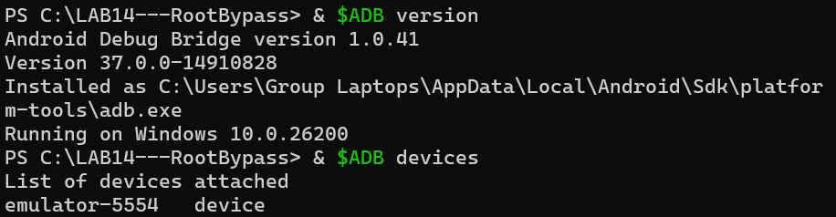

---

## 5. Préparation de frida-server

Pour que Frida puisse injecter des scripts dans les applications Android, il faut démarrer `frida-server` sur l’appareil cible.

J’ai copié le binaire vers l’émulateur avec :

```powershell
$ADB push .\frida-server /data/local/tmp/frida-server
$ADB shell chmod 755 /data/local/tmp/frida-server
```

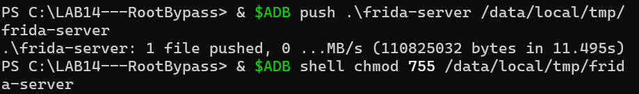

Ensuite, j’ai lancé le serveur Frida sur Android :

```powershell
$ADB root
$ADB shell /data/local/tmp/frida-server
```

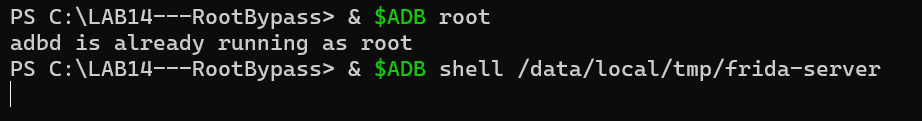

Dans mon cas, ADB indiquait que le daemon était déjà lancé avec les droits root, ce qui permettait d’exécuter directement `frida-server`.

---

## 6. Vérification de la communication Frida

Après le démarrage de `frida-server`, j’ai utilisé la commande suivante pour vérifier que Frida voyait les applications Android :

```powershell
frida-ps -Uai
```

Cette commande a affiché la liste des applications installées et actives sur l’émulateur.

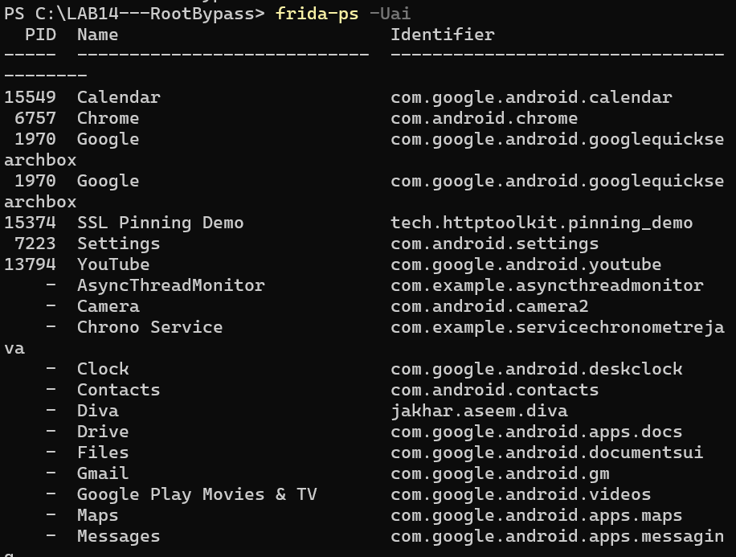

J’ai ensuite filtré la liste pour retrouver l’application cible RootBeer Sample :

```powershell
frida-ps -Uai | findstr Root
```

Le package identifié est :

```text
com.scottyab.rootbeer.sample
```

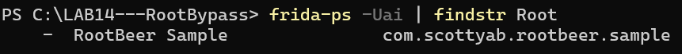

---

## 7. État initial de l’application avant bypass

Avant d’injecter les scripts, j’ai lancé RootBeer Sample normalement sur l’émulateur.

L’application détecte plusieurs indicateurs liés au root et affiche l’état :

```text
ROOTED
```

Cette étape est importante, car elle sert de référence avant l’application du contournement.

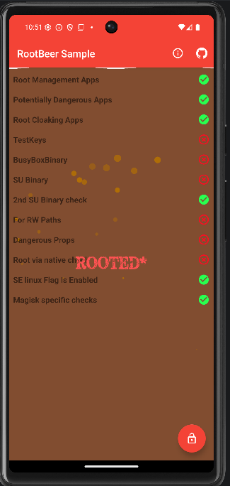

On remarque que certains contrôles sont validés comme suspects, par exemple les contrôles liés aux binaires `su`, aux propriétés dangereuses ou aux vérifications natives.

---

## 8. Test d’injection simple avec hello.js

Avant de lancer un bypass complet, j’ai créé un script minimal `hello.js` pour vérifier que Frida pouvait bien s’attacher au processus de l’application.

Contenu du script :

```javascript
Java.perform(function () {
    console.log("[LAB14] Injection réussie : la VM Java est accessible.");
});
```

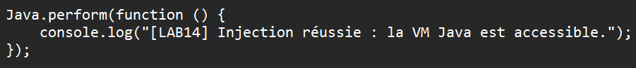

Pendant le lab, le mode spawn avec `-f` a posé problème dans mon environnement.
J’ai donc utilisé une méthode plus stable : ouvrir l’application dans l’émulateur, récupérer son PID, puis attacher Frida au processus déjà lancé.

Commande utilisée :

```powershell
frida -U -p 16021 -l .\scripts\hello.js
```

Le message suivant confirme que l’injection a réussi :

```text
[LAB14] Injection réussie : la VM Java est accessible.
```

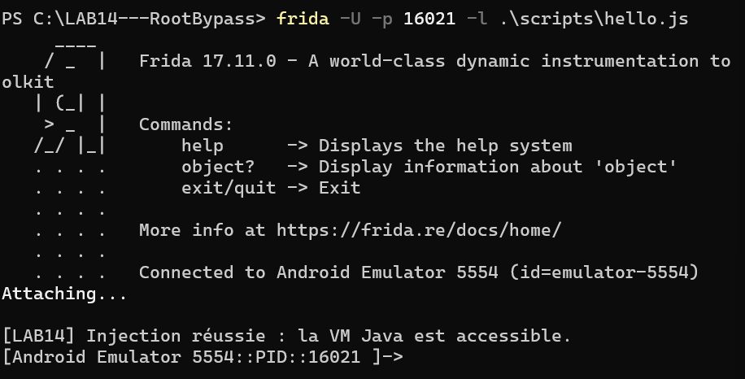

Cette étape prouve que Frida peut interagir avec l’application cible.

---

## 9. Bypass Java de la détection root

Après avoir validé l’injection, j’ai utilisé le script :

```text
scripts/bypass_root_java.js
```

Ce script agit sur les vérifications Java classiques utilisées par les applications Android pour détecter le root.

Il permet notamment de :

* remplacer la valeur de `Build.TAGS` par `release-keys` ;
* masquer certains fichiers liés au root ;
* intercepter `java.io.File.exists()` ;
* bloquer des commandes suspectes exécutées avec `Runtime.exec()` ;
* neutraliser certaines vérifications Java de type RootBeer lorsque les méthodes sont disponibles.

Commande utilisée :

```powershell
frida -U -p 16021 -l .\scripts\bypass_root_java.js
```

Dans les logs, on voit que les hooks Java ont été installés correctement :

```text
[LAB14] Installation des hooks Java...
[OK] Build.TAGS remplacé par release-keys
[OK] Hooks Java installés
[OK] Hook Runtime.exec installé
[LAB14] Bypass Java terminé.
```

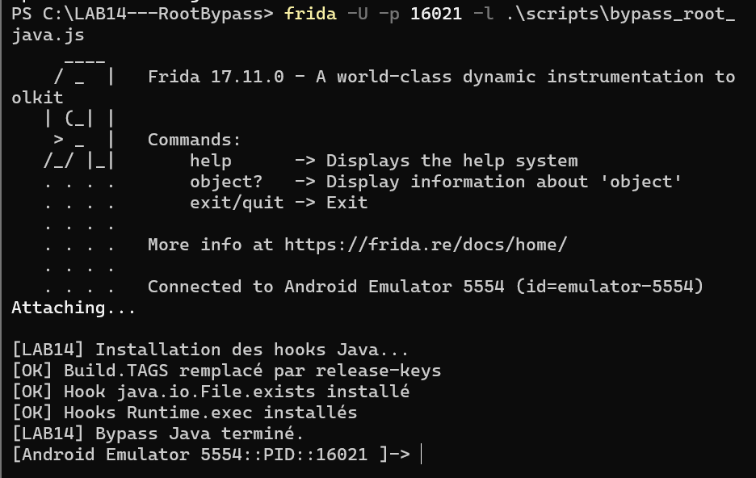

Cette partie montre que les vérifications Java peuvent être modifiées dynamiquement au moment de l’exécution, sans reconstruire ni patcher l’APK.

---

## 10. Bypass natif avec Frida

Certaines applications utilisent aussi du code natif pour chercher des traces de root.
Dans ce cas, les vérifications ne passent pas uniquement par Java. Elles peuvent utiliser des fonctions comme :

```text
open
openat
access
stat
lstat
```

Pour cette raison, j’ai ajouté un script natif :

```text
scripts/bypass_root_native_frida17.js
```

Ce script intercepte certains appels natifs liés à la bibliothèque `libc.so` et bloque les chemins suspects, comme :

```text
/system/bin/su
/system/xbin/su
/sbin/su
/system/bin/busybox
/system/xbin/busybox
```

Commande utilisée :

```powershell
frida -U -p 16021 -l .\scripts\bypass_root_native_frida17.js
```

Les hooks natifs ont bien été chargés :

```text
[OK] Hook natif installé : open
[OK] Hook natif installé : openat
[OK] Hook natif installé : access
[OK] Hook natif installé : stat
[OK] Hook natif installé : lstat
[LAB14] Hooks natifs chargés.
```

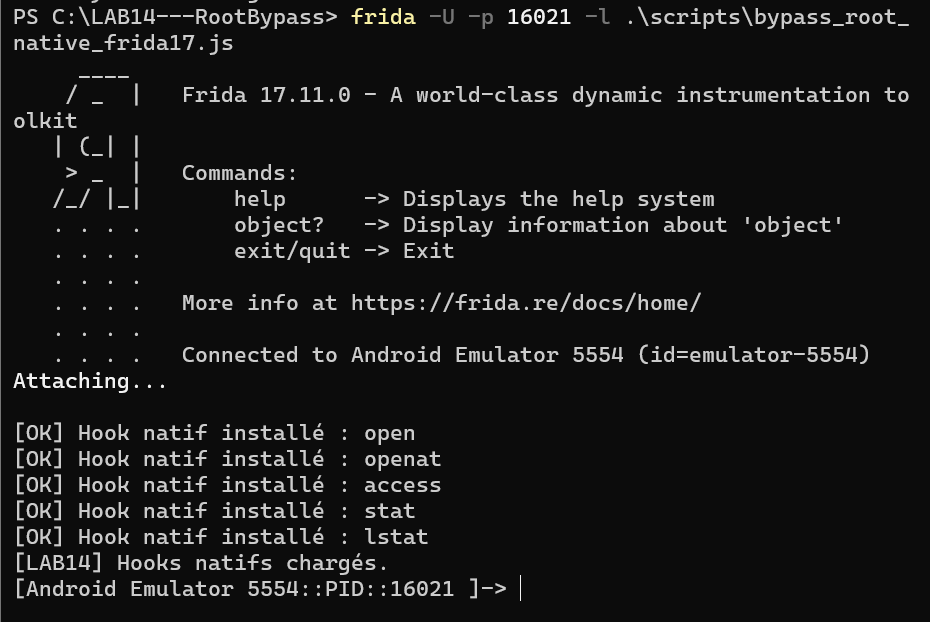

Cette partie complète le bypass Java, car elle couvre les vérifications effectuées plus bas dans le système.

---

## 11. Utilisation d’Objection

Après les tests manuels avec Frida, j’ai utilisé Objection pour comparer avec une méthode plus automatisée.

La nouvelle syntaxe recommandée est :

```powershell
objection -n com.scottyab.rootbeer.sample start
```

Objection s’est attaché correctement à l’application :

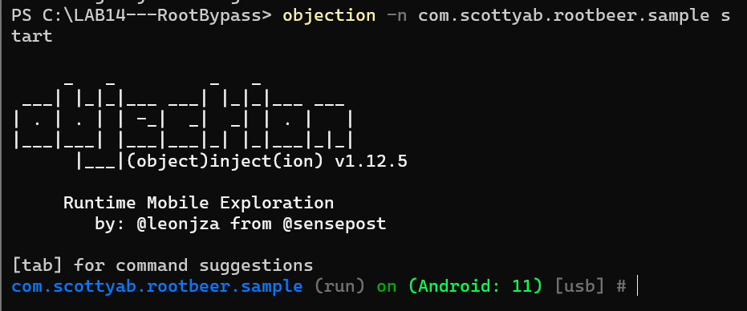

Ensuite, j’ai exécuté la commande suivante dans la console Objection :

```text
android root disable
```

Cette commande lance automatiquement un ensemble de hooks destinés à masquer plusieurs indicateurs de root.

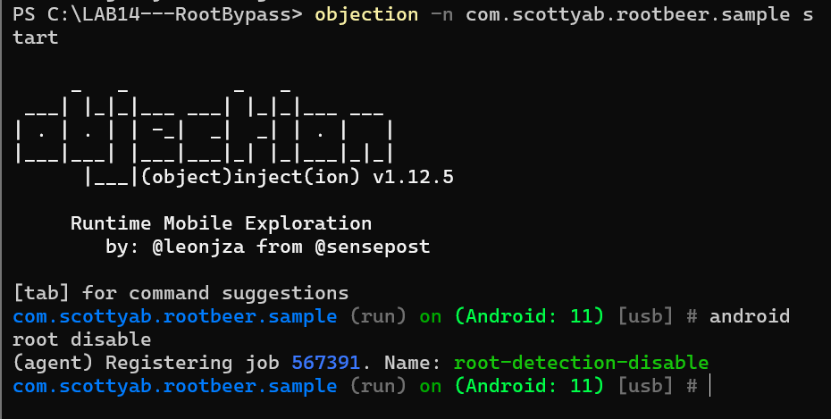

J’ai aussi testé le lancement avec une commande de démarrage automatique :

```powershell
objection -g com.scottyab.rootbeer.sample explore --startup-command "android root disable"
```

Même si Objection affiche des avertissements de dépréciation pour l’ancienne syntaxe `-g` et `explore`, l’attachement à l’application fonctionne correctement.

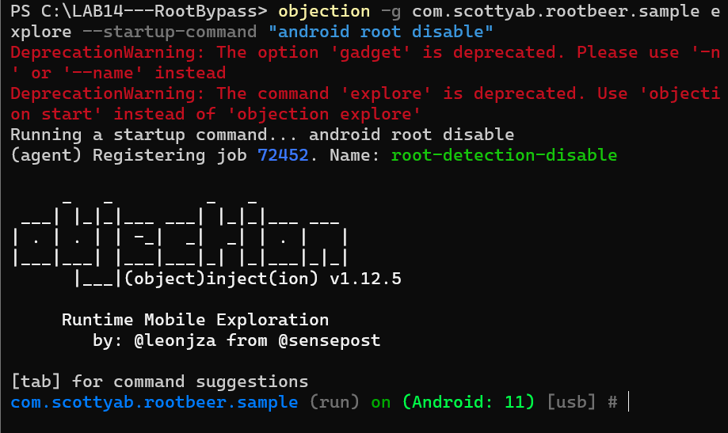

---

## 12. Résultat après bypass

Après l’injection des hooks et l’utilisation d’Objection, j’ai relancé le test dans RootBeer Sample.

L’état final de l’application est devenu :

```text
NOT ROOTED
```

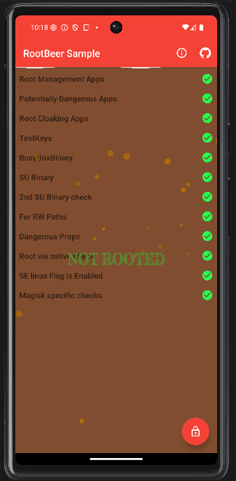

Cette capture confirme que les contrôles root visibles dans l’application ont été contournés avec succès.
Les indicateurs qui apparaissaient comme suspects avant le bypass sont maintenant neutralisés.

---

## 13. Comparaison avant / après

| Étape                 | Résultat observé                                 |
| --------------------- | ------------------------------------------------ |
| Avant injection       | L’application affiche `ROOTED`                   |
| Après injection Frida | Les hooks Java et natifs sont chargés            |
| Après Objection       | La détection root est désactivée automatiquement |
| Résultat final        | L’application affiche `NOT ROOTED`               |

Avant bypass :


Après bypass :


---

## 14. Difficulté rencontrée pendant le lab

Un point important rencontré pendant le lab concerne le mode de lancement Frida.

La commande en mode spawn avec `-f` n’a pas été utilisée dans le résultat final, car elle posait problème dans mon environnement.
J’ai donc adapté la méthode en ouvrant d’abord l’application dans l’émulateur, puis en utilisant l’attachement par PID :

```powershell
frida -U -p 16021 -l .\scripts\hello.js
```

Cette adaptation m’a permis de continuer le lab sans bloquer sur le démarrage de l’application par Frida.

Ce choix rend le travail plus réaliste, car en analyse dynamique il est fréquent de devoir adapter la méthode selon le comportement de l’application, la version Android ou la version de Frida.

---

## 15. Analyse personnelle

Ce lab m’a permis de mieux comprendre comment une application Android peut détecter un environnement rooté.
La détection ne repose pas sur un seul élément, mais sur plusieurs indices : fichiers système, commandes, propriétés Android et parfois appels natifs.

La partie Frida m’a permis de voir précisément quelles fonctions peuvent être interceptées.
Le script Java est utile pour les contrôles classiques comme `File.exists()` ou `Runtime.exec()`, tandis que le script natif devient nécessaire lorsque l’application effectue des vérifications plus proches du système.

Objection est plus rapide à utiliser, car il automatise une partie du travail. Cependant, Frida reste plus flexible pour comprendre et personnaliser le contournement.

---

## 16. Conclusion

Le LAB 14 a été réalisé avec succès.
L’application RootBeer Sample détectait initialement l’environnement comme rooté. Après l’injection des hooks Java, l’ajout des hooks natifs et le test avec Objection, l’application affiche finalement l’état `NOT ROOTED`.

Ce résultat montre que la détection root côté application peut être contournée lorsqu’elle repose uniquement sur des vérifications locales.
Pour une application réelle, ces contrôles doivent donc être considérés comme une couche de défense supplémentaire, mais pas comme une protection suffisante à eux seuls.

Le lab m’a surtout permis de pratiquer l’analyse dynamique Android, l’attachement Frida par PID, l’interception de méthodes Java, les hooks natifs et l’utilisation d’Objection dans un scénario concret.
